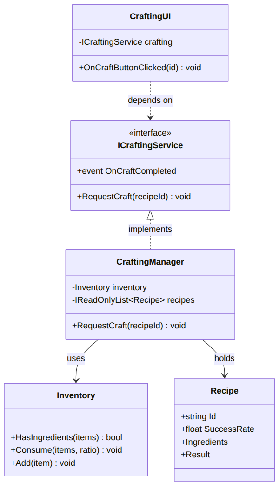
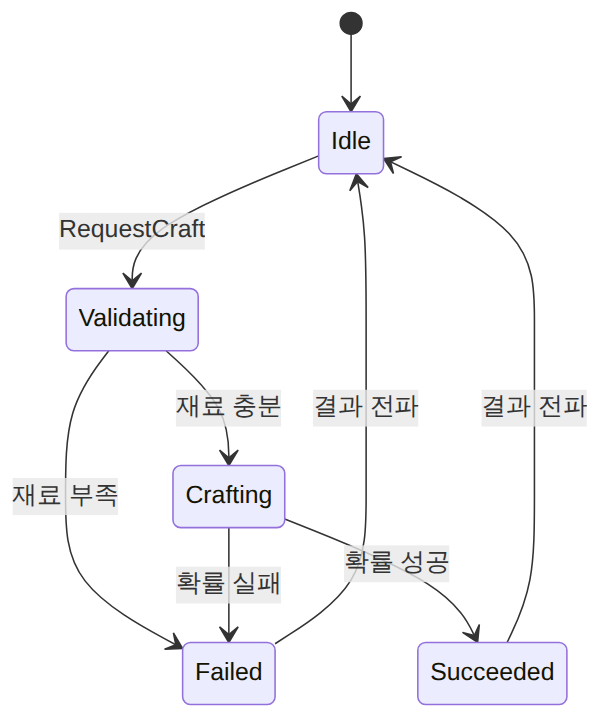
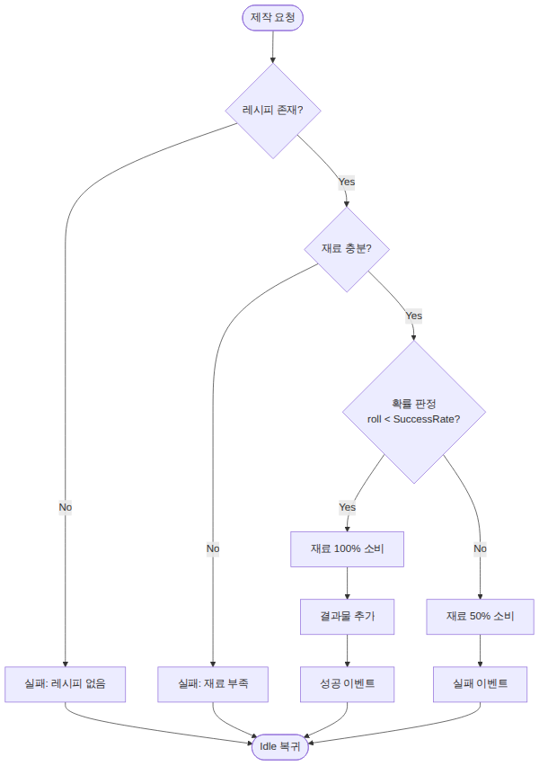
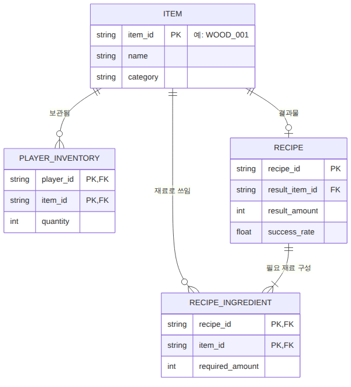

<!-- _class: title -->
<!-- _paginate: false -->

# 유니티 개발자<br>취업·기술 문서 가이드

<div class="sub">v2 — 문서 · 레이아웃 · 다이어그램 · AI</div>

<div class="author">김재훈 (Jay / KooHoo)</div>

---

<!-- _class: divider -->
<span class="eyebrow">Orientation</span>

# 이 가이드가 다루는 것

---

## 6개 파트, 하나의 흐름

| Part | 내용 | 한마디 |
|---|---|---|
| 1 | 취업 문서 | 이력서·자소서·포트폴리오 |
| 2 | 기술 문서 | 개요→구조→기능→선택→회고 |
| 3 | 레이아웃 | 정보를 잘 전달하는 화면 |
| 4 | Mermaid | 코드로 그리는 다이어그램 |
| 5 | AI 워크플로우 | 챗봇으로 문서 가속 |
| 6 | 프롬프트 | 복사해 쓰는 한글 프롬프트 |

**목적**: 잘 읽히는 문서로 *"함께 일하고 싶은 개발자"* 임을 증명하기

---

## 두 가지 산출물, 하나의 소스

- **Markdown 소스** → GitHub에서 바로 읽기 (Mermaid 네이티브 렌더링)
- **프레젠테이션** → Marp 슬라이드 → HTML/PDF 배포

> 문서를 **Markdown으로 한 번** 쓰면, 읽기용 문서와 발표용 슬라이드를 **동시에** 얻습니다.

---

<!-- _class: divider -->
<span class="eyebrow">Part 1</span>

# 취업 문서

---

## 이력서 · 자기소개서 · 포트폴리오

- **이력서** — 1~2페이지, 한눈에 핵심 역량. 기술 스택은 **별점 금지, 경험 중심**
- **자기소개서** — 원천 소스 → 문항 매핑 → **STAR**(상황·과제·행동·결과)
- **포트폴리오** — 실물로 증명. *자격증보다 훨씬 중요*

| ❌ 나쁜 예 | ✅ 좋은 예 |
|---|---|
| Unity ★★★ | Unity – FSM 전투 시스템 설계 경험 |

---

<!-- _class: divider -->
<span class="eyebrow">Part 2</span>

# 기술 문서

---

## 기술 문서의 5단 구조

```
1. 개요        무엇을, 왜 만들었나 (결론부터, 10초 안에)
2. 시스템 구조   구성요소·관계·흐름 (다이어그램)
3. 핵심 기능     사용법(API) + 핵심 동작(코드 설명)
4. 고민과 선택   대안 비교 → '왜'의 근거
5. 결과·배운 점  데이터로 증명 + 기술 부채·개선
```

> 목적은 *"코드를 짤 줄 안다"* 가 아니라 **"내 코드를 설명할 줄 안다"**.
> = 개발 커뮤니케이션이 된다 = **함께 일할 수 있다**

---

## 고민과 선택: '그냥'은 금지

<div class="columns">
<div>

**[A] 직접 참조**
+ 직관적, 추적 쉬움
− 강한 결합

</div>
<div>

**[B] 이벤트 전파**
+ 느슨한 결합, 확장 용이
− 흐름 추적 ↓

</div>
</div>

> **결정: B** — 결과를 쓸 대상(UI·사운드·통계)이 늘어날 것이므로.
> 면접관이 가장 보고 싶어 하는 건 이 **판단의 근거**입니다.

---

<!-- _class: divider -->
<span class="eyebrow">Part 3</span>

# 프레젠테이션 레이아웃

---

## 레이아웃 3원칙 + 8유형

**3원칙**: 한 화면 한 메시지 · 정렬과 여백 · 위계

| 유형 | 용도 | | 유형 | 용도 |
|---|---|---|---|---|
| 표지 | 첫인상 | | 다이어그램 중심 ★ | 구조 시각화 |
| 목차 | 전체 지도 | | 코드+설명 2단 | 구현 증명 |
| 개요 | What/Why | | 비교 ★ | 판단 근거 |
| 타임라인 | 순서·흐름 | | 회고 | 정리·전망 |

> ★ = 여러분의 **다이어그램이 가장 잘 사는** 레이아웃

---

<!-- _class: divider -->
<span class="eyebrow">Part 4</span>

# Mermaid 다이어그램

---

<!-- _class: diagram -->
## 클래스 다이어그램



<div class="caption">CraftingUI가 인터페이스에 의존(점선) = 느슨한 결합의 증거 (DIP)</div>

---

<!-- _class: diagram -->
## 시퀀스 다이어그램


<div class="caption">결과 전파는 이벤트(점선) — Manager는 UI를 직접 호출하지 않음</div>

---

<!-- _class: diagram -->
## 상태(FSM) 다이어그램



<div class="caption">Crafting에서 성공/실패로 분기 = 확률 기반 규칙의 시각화</div>

---

<!-- _class: diagram -->
## 플로우차트 · ER

<div class="columns">
<div>



</div>
<div>



</div>
</div>

<div class="caption">로직의 갈림길(좌) / 데이터 저장 구조(우)</div>

---

## 5종, 하나의 시스템

| 다이어그램 | 답하는 질문 |
|---|---|
| 클래스 | 무엇으로 이루어졌나 (런타임 구조) |
| 시퀀스 | 시간 순서로 어떻게 상호작용하나 |
| 상태(FSM) | 어떤 상태를 오가나 |
| 플로우차트 | 어떤 갈림길을 지나나 (로직) |
| ER | 데이터가 어떻게 저장되나 (저장 구조) |

> 다 넣지 말고, **설명하려는 것**에 맞는 1~2개를 고르세요.

---

<!-- _class: divider -->
<span class="eyebrow">Part 5</span>

# AI 활용 워크플로우

---

## AI는 '초안 생성기'다

```
1. 기능 설명하기   → 내가 만든 것을 AI에게 설명
2. 다이어그램 생성 → Mermaid 코드
3. 문서 초안 생성  → 5단 구조 틀
4. 다듬기 ★       → 내 언어·경험·'왜'로 교체
5. 이미지 변환     → mermaid.live 클릭
```

> ★ **4번이 실력 구간.** 1·5는 AI·도구가 돕지만, 4는 오직 여러분만.

---

<!-- _class: dark -->
## 주의: 이해 없이 복붙 금지

- 문서에 넣는 **모든 것을 내가 설명할 수 있어야** 한다
- AI는 그럴듯하게 **틀린다** → 코드는 실행, 다이어그램은 대조로 검증
- **'고민과 선택'** 은 AI가 대신 못 한다 (내 실제 의사결정)

> **AI로 속도를 얻되, 이해로 실력을 증명하라.**

---

<!-- _class: divider -->
<span class="eyebrow">Part 6</span>

# 좋은 레이아웃 프롬프트

---

## 프롬프트 4요소 + 두 트랙

**좋은 프롬프트** = 역할 + 맥락 + 제약 + 출력 형식

<div class="columns">
<div>

**트랙 A — Marp**
발표·PDF용 슬라이드
(마크다운, 가볍고 빠름)

</div>
<div>

**트랙 B — React**
포트폴리오 웹페이지
(단일 HTML, 깔끔)

</div>
</div>

> **만능 틀 4개**(다이어그램·Marp·React·다듬기)로 대부분 대응.
> 특히 **다듬기 틀**로 반복 개선.

---

<!-- _class: dark -->
## 핵심 코드: RequestCraft

```csharp
public void RequestCraft(string recipeId)
{
    var recipe = FindRecipe(recipeId);      // LINQ
    if (recipe == null) { /* 실패 */ return; }

    // (Why) 소비 전 검증 → 재료 유실 방지
    if (!inventory.HasIngredients(recipe.Ingredients)) return;

    var success = roll() < recipe.SuccessRate;   // 주입 → 테스트 가능
    inventory.Consume(recipe.Ingredients, success ? 1.0f : 0.5f);
    if (success) inventory.Add(recipe.Result);

    Publish(/* 성공/실패 이벤트 */);            // 느슨한 결합
}
```

---

<!-- _class: title -->
<!-- _paginate: false -->

# 정리

<div class="sub">도구와 AI는 속도를 줄 뿐,<br>이해하고 판단한 것만이 실력으로 남습니다.</div>

<div class="author">잘 읽히는 문서로, 함께 일하고 싶은 개발자임을 증명하세요.</div>
