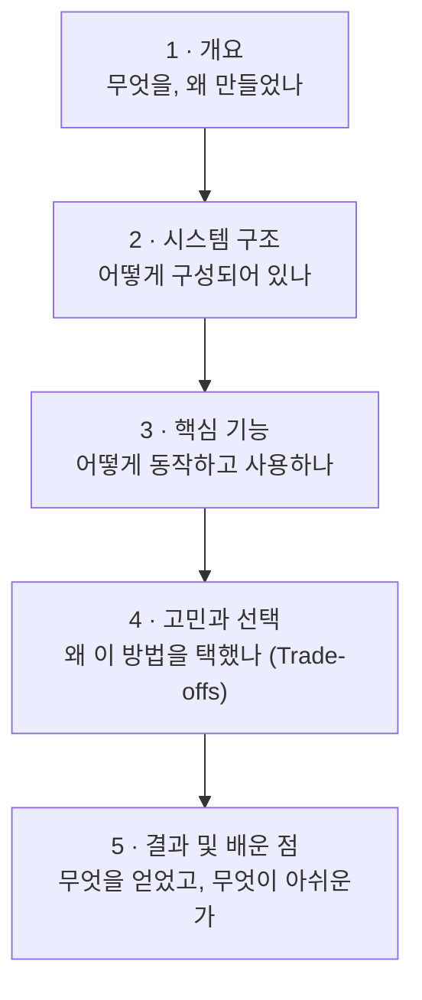
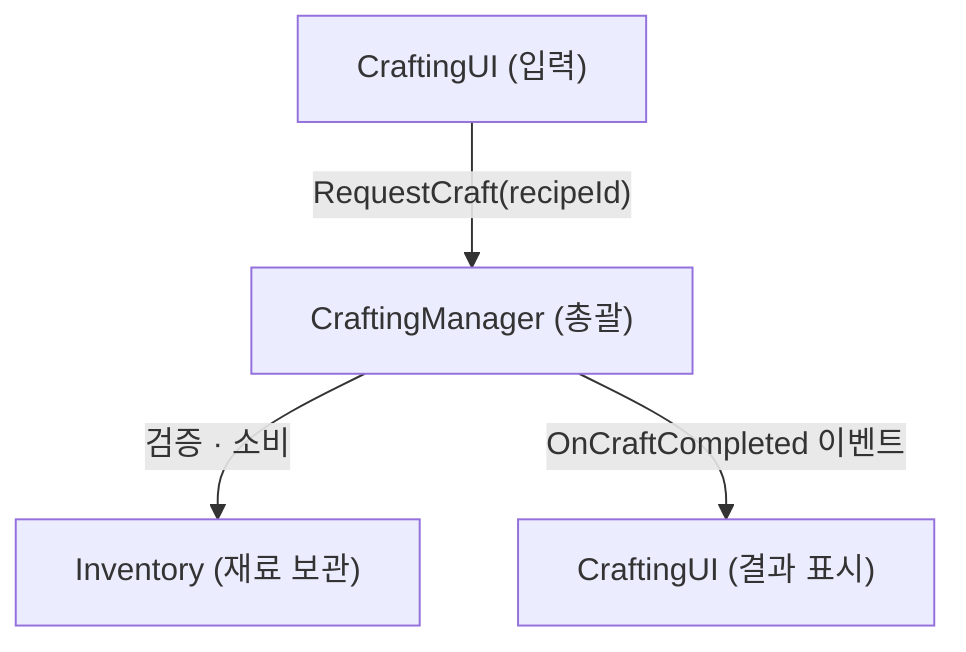
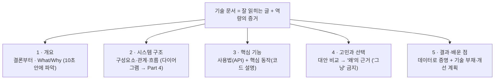

# Part 2. 기술 문서 작성 가이드

이 파트는 여러분이 만든 프로젝트나 기능을 **다른 사람(미래의 나, 동료, 면접관)** 에게
명확하게 설명하기 위한 가이드입니다.

## 기술 문서란?

소프트웨어의 기능·아키텍처·사용법·구축 과정을 기술적 형식에 맞춰 논리적으로 작성한 문서입니다.
목적은 두 가지입니다.

- **지식의 명시화** — 머릿속에만 있는 추상적 로직과 설계 의도를, 텍스트·다이어그램·코드로
  누구나 열람 가능한 형태로 구체화합니다.
- **소통의 매개체** — 서로 다른 배경지식을 가진 이해관계자(개발자 ↔ 개발자, 개발자 ↔ 비개발자)에게
  작동 원리를 정확히 전달하는 프로토콜 역할을 합니다.

> 핵심은 하나입니다. **`잘 읽히는 기술 문서`** + **`역량을 드러내는 문서`**.
> 기술만 잔뜩 나열한 문서는 읽는 사람(=개발자)에게 시간 낭비에 가깝습니다.

## 기술 문서의 5단 구조

취업용 기술 문서는 아래 논리 흐름을 뼈대로 삼습니다.



프로젝트 규모에 따라 구조는 유연하게 변형합니다.

| 유형 | 구조 |
|---|---|
| **A. 단일 기능** | 개요 → 시스템 구조 → 핵심 기능 → 고민과 선택 → 결과 |
| **B. 다기능** | 프로젝트 개요 → (기능별로 구조·기능·선택 반복) → 결과 |
| **C. 팀 프로젝트** | 개요·팀·역할 소개 → 담당 파트 개요 → 구조 → 기능 → 고민(협업 이슈) → 결과 |

> 늘 말하지만 **법칙이 아닙니다.** 목적에 부합하는 구조와 내용을 담는 것이 중요합니다.

### 작성 도구 팁

- 문서 툴은 무엇이든 무방하나, **텍스트 소스는 Markdown으로 먼저** 쓰기를 권장합니다.
- 최종 출력은 **PDF가 가능한 플랫폼**을 고르세요. (기업 보안 정책상 외부 링크가 막힌 곳이 있습니다.)
- 이 가이드는 이후 Markdown → Mermaid(Part 4) → 레이아웃·슬라이드(Part 3) 흐름으로 이어집니다.

> **이 파트의 관통 예제**: 각 섹션의 **핵심 워크스루 예시**는 **크래프팅 시스템**
> (재료를 소비해 아이템을 제작하는 시스템)으로 통일합니다. Part 4~6에서 같은 예제로
> 다이어그램과 프롬프트를 다루므로, 여기서 흐름을 익혀 두면 자연스럽게 연결됩니다.
> (개념 이해를 돕는 👎/👍 대비 예시는 오브젝트 풀링·인벤토리 등 상황에 맞는 다른 사례도 씁니다.)

---

## 1. 개요: 무엇을, 왜 설명하나요?

문서의 **결론부터** 제시하는 곳입니다. 읽는 사람이 **10초 안에 핵심을 파악**할 수 있어야 합니다.
(비유: 게임의 퀘스트 로그 — "무엇을 해야 하는지" 한 줄로 보여주는 것)

### 들어갈 내용

- **프로젝트/기능 요약 (What)** — 이 문서가 무엇을 설명하는가
- **개발 배경 및 목적 (Why)** — 어떤 문제가 있었고, 왜 이렇게 해결하려 했는가
- **개발 환경** — 엔진 버전, 도구, 기간
- **링크** — 데모 영상, GitHub 등

> 보통 1장으로 끝내지만, 마일스톤(일정) 같은 이미지를 더해 2장으로 구성해도 좋습니다.

### 개념 더 깊이: 독자를 위한 '지도'와 '나침반'

개발자는 자신이 무엇을 만들었는지 잘 알지만, 문서를 읽는 사람은 **아무런 배경지식이 없습니다.**
개요는 이 정보의 비대칭을 해소하고 독자를 **'같은 출발선'** 에 세우는 과정입니다.

- **무엇을 (What) — '지도':** 독자에게 지금부터 탐험할 영역(범위)을 보여줍니다.
  *"이 문서는 게임 전체가 아니라, 그중 '캐릭터 상태 이상 시스템'만 다룹니다."* 처럼요.
- **왜 (Why) — '나침반':** 왜 이 지도를 펼쳐야 하는지 방향과 목적을 가리킵니다.
  이 문서가 해결하려는 **'문제'** 와 제공하는 **'가치'** 를 명확히 짚어야 합니다.

> 읽는 사람에게 배경지식을 깔아 주는 작업입니다. 이 부분에서 읽는 사람의 흥미가 생기면 Best.

### 👎 아쉬운 예 / 👍 좋은 예

**👎 아쉬운 개요 — '왜'가 없다**

```
본 문서는 Unity 프로젝트의 인벤토리 시스템에 대해 설명합니다.
C#의 List<Item>를 사용하여 아이템을 추가, 삭제, 사용하는 기능을 구현했습니다.
```

- **문제점:** 그래서 '왜' 만들었나요? 기존에 인벤토리가 없었나요? `List`를 고른 특별한 이유가 있나요?
  독자는 이 기능의 **필요성이나 중요도**를 전혀 알 수 없습니다. ("게임 로딩이 느린 것 같아서 고쳤습니다"도
  마찬가지 — '느린 것 같다'는 주관적이고, '개선했다'는 모호합니다.)

**👍 좋은 개요 — What·Why·증거가 명확 ('오브젝트 풀링' 최적화)**

```
'오브젝트 풀링(Object Pooling)' 도입 및 (Why) 모바일 프레임 드랍 개선

(문제 정의)
기존 슈팅 로직은 총알(Bullet)이 발사될 때마다 Instantiate()(생성)하고, 화면을 벗어나면
Destroy()(파괴)했습니다. 이 방식은 초당 100개 이상의 총알이 나오는 '보스전'에서 심각한
GC(가비지 컬렉터) 스파이크를 유발했고, (증거) 테스트 기기(Galaxy S10)에서 초당 10~15
프레임이 드랍되는 치명적 성능 저하가 발생했습니다.

(해결책)
이를 해결하기 위해 총알을 미리 생성해 두고(Pool) 재사용하는 '오브젝트 풀링' 패턴을 도입합니다.

(범위)
본 문서는 PoolManager의 C# 설계, 핵심 구현 코드, 그리고 Instantiate 방식과의 성능 비교를 설명합니다.
```

- **좋은 이유:** ① 명확한 **What**("오브젝트 풀링 도입") ② 명확한 **Why**("GC 과부하·프레임 드랍")
  ③ **구체적 증거**("초당 100개", "10~15fps 드랍") — 문제를 누구나 공감하게 함 ④ 마지막에
  **앞으로 나올 이야기를 예고**(Preview).

### 예시: 크래프팅 시스템 개요

> **프로젝트/기능 요약 (What)**
> 이 문서는 유니티(C#) 생존 게임의 **아이템 크래프팅 시스템**을 설계·구현한 과정을 설명합니다.
> 플레이어가 인벤토리의 재료를 소비해, 레시피에 정의된 결과물을 확률적으로 제작합니다.
>
> **개발 배경 및 목적 (Why)**
> 초기에는 제작 로직이 UI 코드 안에 뒤섞여 있어, 새 레시피를 추가할 때마다 UI를 수정해야 했고
> 확률·실패 처리를 테스트하기 어려웠습니다. (문제)
> 이를 해결하기 위해 **제작 로직을 UI와 분리**하고, **이벤트로 결과를 전파**하는 구조를 도입했습니다. (목적)
>
> **개발 환경**
> - Engine: Unity 2022.3 LTS (C# 10)
> - Core: 이벤트 기반 아키텍처, LINQ
> - 기간: 2025.06 ~ 2025.07 (개인 프로젝트)
>
> **링크**: [GitHub](#) · [시연 영상](#)

### 팁

- **개요는 "앞으로 어떤 이야기를 할 것이다"의 예고편**입니다. 여기서 언급한 항목을
  이후 섹션에서 하나씩 자세히 풀어냅니다.
- What과 Why를 반드시 분리하세요. 특히 **Why(문제 상황)** 가 없으면 나머지 문서 전체가
  "그래서 왜 만들었는데?"라는 질문에 답하지 못합니다.
- **개요는 맨 마지막에 다시 쓰세요.** 문서를 다 쓰고 나면 하려던 이야기가 훨씬 명확해집니다.
  초안은 처음에 쓰더라도, **최종 개요는 모든 작성이 끝난 뒤 퇴고**하는 것이 가장 좋습니다.
- **스스로 "So What?"(그래서 뭐?)을 반복하세요.** "인벤토리를 만들었다" → "그래서?" →
  "아이템을 저장해야 하니까" → "그래서?" → "그래야 플레이어가 성장·모험을 이어가니까!"
  이렇게 표면적 What에서 **근본 Why**로 내려갑니다.
- **'문제'를 측정 가능하게 정의하세요.** "느리다" 대신 "로딩에 15초 걸린다", "아이템 쓰려면
  5번 클릭해야 한다"처럼. 이 구체적인 문제가 곧 'Why'가 됩니다.

---

## 2. 시스템 구조: 어떻게 구성되어 있나요?

전체 그림을 먼저 보여주어 독자가 **길을 잃지 않게** 하는 섹션입니다.
단순히 "사용한 기술 목록"을 나열하는 것이 아닙니다. 아래 세 가지를 정의합니다.

- **구성요소 (Components)** — 시스템을 이루는 큰 모듈이나 클래스
- **관계 (Relationships)** — 한 구성요소가 다른 것을 '알고' 있는지, '제어'하는지,
  '데이터를 받기'만 하는지 등의 책임
- **흐름 (Flow)** — 입력(Input)이 어떤 구성요소를 거쳐 어떤 결과(Output)로 이어지는지의 순서

> **다이어그램을 적극 활용하세요.** 클래스 다이어그램·시퀀스 다이어그램 등으로 사고 과정을
> 시각화합니다. 작성법은 **Part 4(Mermaid)** 에서 다룹니다.
> (Mermaid·PlantUML 등은 AI에게 코드 생성을 요청하면 잘 만들어 줍니다 → Part 5)

### 들어갈 내용

- **아키텍처 다이어그램** — 구성요소 간 데이터/명령의 흐름
- **핵심 기술 스택** — 엔진 버전, 핵심 자료구조·패턴
- **핵심 클래스 역할 분담** — 각 클래스가 무슨 책임을 지는가

### 비유: 레스토랑 주방 시스템

여러분의 프로젝트를 **하나의 레스토랑**이라고 생각해 봅시다. 손님이 "스테이크 주세요"라고
주문(Input)하고 스테이크를 받는(Output) 과정은 이렇습니다.

| 역할 | 프로그램 대응 | 하는 일 (그리고 하지 않는 일) |
|---|---|---|
| **손님** | User | 주문을 한다 |
| **웨이터** | View / UI | 주문을 받아 '주방'에 전달. **요리(Logic)는 할 줄 모른다** |
| **주방장** | Controller / Manager | 주문을 받고 요리사에게 지시. **직접 요리하지 않고 지시·조율만** |
| **요리사** | Logic / Service | 냉장고에서 재료를 가져와 레시피대로 요리 |
| **냉장고** | Model / Data | 재료(데이터)를 보관만 한다 |

여기서 '시스템 구조'란 **"웨이터는 주방장에게만, 주방장은 요리사에게만, 요리사는 냉장고에만
접근한다"** 는 **규칙과 흐름**을 정의한 '업무 분장표'입니다. 이 구조가 없다면 손님이 직접 냉장고를
뒤지거나(보안 문제), 요리사가 주문받으러 홀에 나가는(유지보수 재앙) 혼란이 생깁니다.

### 👎 아쉬운 예 / 👍 좋은 예 (인벤토리 시스템)

**👎 구조가 없는 '갓(God) 클래스'**

> `Player.cs` 스크립트 하나에 모든 것을 구현했습니다. `Update()` 안에서 'I' 키를 누르면 인벤토리
> UI를 켜고, 클릭을 감지해 아이템을 사용하고, `List<Item>`에 추가/삭제하며, `PlayerPrefs`로 저장까지 합니다.

- **문제점:** 이것은 '레스토랑'이 아니라 **'푸드트럭'** 입니다. 사장(`Player.cs`) 혼자 주문·요리·서빙·계산을
  다 합니다. **(Why)** 당장은 빨라도, "UI를 클릭에서 드래그로 변경"하려면 '요리' 로직과 '저장' 로직이
  얽힌 코드를 건드려야 해서 100% 버그가 납니다.

**👍 역할과 흐름이 명확한 구조 (관심사 3분리)**

> UI(View)·데이터(Model)·관리(Controller)로 분리했습니다.
> - **`InventoryUI` (웨이터):** 창을 켜고 끄며 슬롯을 표시. 클릭되면 직접 처리하지 않고 Manager에게 "3번 슬롯 클릭됨"만 **알린다.**
> - **`Inventory` (냉장고):** 아이템 데이터(`List<ItemData>`)를 **보관만** 한다. `Update()`도, UI 코드도 없다.
> - **`InventoryManager` (주방장):** 둘 사이의 **중재자.** "3번 클릭됨"을 받으면 데이터를 확인하고 로직을 실행한 뒤, UI에 "아이콘 비워라"라고 **지시**한다.
>
> `[클릭]` → `[InventoryUI]` → `[InventoryManager]` → `[Inventory]` → (처리 후) → `[InventoryUI 갱신]`

- **좋은 이유:** 각 클래스의 **책임이 명확**합니다. **(Why)** UI 디자인을 통째로 바꿔도 `InventoryUI`만
  수정하면 되고, Manager·Inventory 코드는 한 줄도 건드릴 필요가 없습니다. 이것이 **유지보수성**입니다.

### 예시: 크래프팅 시스템 구조

**아키텍처 흐름**



**핵심 클래스 역할 분담**

| 클래스 / 인터페이스 | 역할 |
|---|---|
| `ICraftingService` | 제작 서비스의 계약(인터페이스). UI는 구현체가 아닌 **이 계약에 의존** |
| `CraftingManager` | 제작 총괄. 검증 → 확률 판정 → 소비 → 결과 이벤트 발행 |
| `Inventory` | 재료 보관·검증·소비·추가 (LINQ로 재료 조회) |
| `Recipe` | 레시피 데이터 (필요 재료, 결과물, 성공 확률) |
| `CraftingUI` | 사용자 입력 → 제작 요청, 이벤트 구독 → 결과 표시 |

**설계 의도 (미리 보기)**
`CraftingUI`가 `CraftingManager`를 직접 참조하지 않고 `ICraftingService` 인터페이스에 의존하게 한 이유는,
UI를 건드리지 않고도 제작 로직 구현을 교체·테스트할 수 있게 하기 위해서입니다(DIP).
자세한 근거는 **4. 고민과 선택**에서 다룹니다.

### 팁

- **코드로 말하지 말고, 그림으로 말하세요.** 이 섹션의 핵심은 '코드'가 아닙니다. 박스와
  화살표로 그린 다이어그램이 코드 100줄보다 낫습니다. **"누가 누구에게 명령하는가?"** 를
  화살표로 그리는 연습을 하세요.
- **다이어그램은 "요약"입니다.** 모든 클래스를 다 그리지 마세요. 독자가 전체 구조를
  이해하는 데 필요한 핵심 구성요소만 남깁니다.
- **"왜 이렇게 나눴는지"를 설명하세요.** 단순히 "MVC 패턴을 썼습니다"는 의미가 없습니다.
  *왜* MVC가 필요했는지(예: "UI 변경이 잦을 것 같아 로직과 분리")를 한두 줄만 덧붙여도,
  다음 섹션(고민과 선택)으로 자연스럽게 이어집니다.
- **Tech Stack은 '도구'일 뿐입니다.** 기술을 나열하는 건 '내가 가진 망치와 못'을 보여주는 것일 뿐.
  '어떻게 집을 지었는지'는 그 도구로 세운 **골조(설계도)** 를 보여줘야 드러납니다.

---

## 3. 핵심 기능 및 사용법: 어떻게 동작하고 사용하나요?

시스템이 **실제로 어떻게 작동하는지**, 그리고 **어떻게 사용해야 하는지**를
구체적인 코드와 절차로 보여주는 '사용 설명서'입니다.
독자는 이 섹션만 읽고도 해당 기능을 즉시 사용하거나 테스트할 수 있어야 합니다.

2절('시스템 구조')이 건물의 **설계도**였다면, 이 섹션은 **시공 매뉴얼 + 사용법**입니다.

### 두 축: '사용법'과 '핵심 동작'

- **사용법 (How-to-Use)** — 이 기능을 외부에서 쓰려면 어떤 함수를 호출해야 하는가.
  무엇을 입력하면(Input) 무엇이 나오는가(Output). 즉 **API 관점**.
- **핵심 동작 (How it Works)** — 설계도가 실제 코드로 어떻게 구현되었는지 '증거'를 제시.
  단, **모든 코드(1000줄)를 보여주는 것은 최악**입니다. 독자가 "아하!" 하고 깨닫는
  **핵심 로직(50줄)** 만 선별합니다. 잘 설명하면 코드를 안 보여줘도 됩니다.

### 비유: 에어프라이어 설명서

'스마트 인벤토리'라는 최신 에어프라이어를 만들었다고 해봅시다.

- **👎 모든 회로도 첨부:** 50페이지짜리 전기 회로도(`InventoryManager.cs` 500줄 전체)를 붙입니다.
  → (독자: *"그래서 어떻게 켜요? 감자튀김은 몇 도에 돌려요?"*)
- **👎 설명 부족:** *"전원 버튼 누르면 요리가 잘 됩니다."* → (독자: *"전원 버튼이 어디죠? '요리'가 뭘 하죠?"*)
- **👍 좋은 설명서:** **빠른 사용법**(전원 → 모드 '튀김' → 시작)과 **핵심 동작 원리**('튀김'은 초고온
  열풍 순환 로직) 두 가지를 함께 보여줍니다.

### 👎 아쉬운 예 / 👍 좋은 예 (인벤토리 UseItem)

**👎 코드만 나열** — "`InventoryManager.cs` 코드는 다음과 같습니다" → 500줄 전체 붙여넣기.

- **문제점:** 독자에게 '해석'의 부담을 전부 떠넘깁니다. 어디가 중요한지, 왜 이렇게 짰는지, 어떻게
  써야 하는지 아무 정보가 없습니다. (회로도를 그냥 던진 꼴)

**👍 사용법 + 핵심 로직 + Why**

> **사용법(API):** 외부(`InventoryUI`)에서는 `InventoryManager.Instance.UseItem(slotIndex)` 하나만
> 호출하면 됩니다.
> **핵심 로직:** `UseItem()`은 ① Model에서 아이템 조회 → ② 타입을 **`switch`로 검사** → ③ 타입별
> 로직(체력 회복/장비 장착) 실행 → ④ 아이템 제거 순으로 동작합니다.
> **(Why)** `if`가 아니라 `switch`를 쓴 이유는 나중에 '재료'·'퀘스트' 등 **새 타입이 추가돼도 쉽게
> 확장**하기 위해서입니다. `item == null`, 알 수 없는 타입(`default:`) 같은 **예외 처리**도 함께 보여줍니다.

### 예시: 크래프팅 '제작 요청' 기능

**3.1 사용법 (API)**

외부(예: `CraftingUI`)에서는 인터페이스의 `RequestCraft` 하나만 호출하면 됩니다.
결과는 이벤트를 구독해 받습니다.

```csharp
// CraftingUI.cs — 제작 서비스에 '요청'만 하고, 결과는 이벤트로 받는다
public sealed class CraftingUI : MonoBehaviour
{
    private ICraftingService crafting; // (Why) 구현체가 아닌 인터페이스에 의존 (DIP)

    private void OnEnable() =>
        crafting.OnCraftCompleted += HandleResult;

    private void OnDisable() =>
        crafting.OnCraftCompleted -= HandleResult;

    // 버튼 클릭 시 호출
    public void OnCraftButtonClicked(string recipeId) =>
        crafting.RequestCraft(recipeId);

    private void HandleResult(CraftingResult result) =>
        toast.Show(result.IsSuccess ? $"{result.Item.Name} 제작 성공!" : result.Reason);
}
```

**3.2 핵심 동작 (코드 스니펫 + 설명)**

`RequestCraft`는 이 시스템의 심장부입니다. 핵심 로직은 다음과 같습니다.

1. 레시피를 조회한다 (LINQ)
2. **소비 전에** 재료를 검증한다 (방어적 처리)
3. 확률을 판정한다 (주입된 `roll`로 테스트 가능)
4. 성공/실패에 따라 소비율을 달리하고, 결과를 이벤트로 발행한다

```csharp
public void RequestCraft(string recipeId)
{
    var recipe = FindRecipe(recipeId);            // LINQ: FirstOrDefault
    if (recipe == null)
    {
        Publish(CraftingResult.Fail(recipeId, "레시피를 찾을 수 없습니다."));
        return;
    }

    // (Why) 소비 전에 먼저 검증 → 재료 유실 없이 안전하게 중단
    if (!inventory.HasIngredients(recipe.Ingredients))
    {
        Publish(CraftingResult.Fail(recipeId, "재료가 부족합니다."));
        return;
    }

    // (Why) 확률 판정을 주입된 roll로 분리 → 테스트 시 결정론적 검증 가능
    var success = roll() < recipe.SuccessRate;

    // (Why) 성공 100% / 실패 50% 소비로 '실패 페널티' 규칙을 표현
    inventory.Consume(recipe.Ingredients, success ? 1.0f : 0.5f);
    if (success)
        inventory.Add(recipe.Result);

    Publish(success
        ? CraftingResult.Success(recipeId, recipe.Result)
        : CraftingResult.Fail(recipeId, "제작에 실패했습니다."));
}
```

### 팁

1. **'인터페이스'부터 알려주세요.** "이 기능을 쓰려면 이 함수만 알면 됩니다"라고 명확히
   하는 것이 API 설계의 기본입니다. (위 3.1)
2. **코드를 '설명'하세요 (제일 중요).** 주석이든 텍스트 박스든, *"왜 `if`가 아니라 검증을
   먼저 했는지", "왜 `roll`을 주입했는지"* 등 **자신의 생각을 서술**하세요.
3. **예외 상황을 보여주세요.** 성공 케이스뿐 아니라 "레시피가 없다면?", "재료가 부족하면?"
   같은 방어 코드를 보여주는 것은 매우 전문적인 태도입니다.

> 이 섹션의 목적은 *"코드를 짤 줄 안다"* 가 아니라 *"내 코드를 남에게 설명할 줄 안다"* 를
> 보여주는 것입니다. 코드를 설명할 줄 안다 = **개발 커뮤니케이션이 가능하다** =
> *함께 일할 수 있겠다.* 면접에서 기술 문서로 질문하는 회사가 좋은 회사인 이유입니다.

---

## 4. 고민과 선택 (Trade-offs): 왜 이 방법을 선택했나요?

이 섹션은 **"왜 다른 방법이 아닌 이 방법을 선택했는가?"** 에 대한 논리적 변론입니다.
정답을 맞히는 게 아니라, 여러 대안 사이에서 **최선을 고르기 위해 얼마나 깊이 고민했는지**를
증명합니다. 개발자의 **판단력**과 **잠재력**이 드러나는 곳입니다.

> 코드를 따라 치는 사람(Coder)과 스스로 문제를 해결하는 개발자(Developer)를 가르는 기준점.

### 핵심: '정답'이 아닌 '최선'의 근거

모든 상황에 완벽한 만능 기술은 없습니다. 모든 기술에는 **Trade-off(대가)** 가 따릅니다.

- 어떤 기술은 (A) 쓰기 쉽지만 (B) 성능이 느립니다.
- 어떤 기술은 (A) 성능은 좋지만 (B) 배우기 어렵고 시간이 오래 걸립니다.

내 기능과 상황(예: "개발 기간이 1주일")을 고려해, **"왜 A의 장점을 취하고 B의 단점을
감수했는지"** 그 의사결정 과정을 기록합니다. 이것은 *"구글 검색 첫 답을 복붙한 게 아니라, 여러
대안을 비교하고 의식적으로 선택했다"* 는 가장 강력한 증거입니다.

### 비유: 전사의 무기 선택

RPG 속 '전사'가 보스를 잡으러 가기 전 무기를 고른다고 해봅시다.

> **[상황]** 내 캐릭터는 힘은 약하지만 **민첩이 높다.**  **[적]** 보스는 방어력은 낮지만 **공격 속도가 빠르다.**
> - **[대안 A] 양손 도끼:** (+) 강력한 한 방 데미지 / (−) 느린 속도 — 보스의 빠른 공격을 못 피함
> - **[대안 B] 쌍검:** (+) 빠른 공격 속도 — 피하며 여러 번 침 / (−) 낮은 한 방 데미지
> - **[결정]** 내 '민첩'이 높고 보스가 '빠르니', '한 방 데미지'를 포기(**Trade-off**)하고 **쌍검**을 택한다.

'양손 도끼'가 나쁜 무기인가요? 아닙니다. 그저 **'이 상황'에 맞지 않을 뿐**입니다. 기술 선택도 똑같습니다.
이 섹션은 "왜 쌍검을 골랐는지" 그 **근거**를 설명하는 곳입니다. (자소서의 경험 서술도 완전히 같은 구조입니다.)

### 👎 아쉬운 예 / 👍 좋은 예 (최고 점수 저장 방식)

**👎 '고민'이 없다** — "`PlayerPrefs`를 사용해서 최고 점수를 저장했습니다."

- **문제점:** 왜 `PlayerPrefs`였나요? 유일한 방법이었나요? 다른 건 안 알아봤나요? (= "그냥 도끼를 들었다")

**👍 Trade-off가 명확**

> **[대안 A] `PlayerPrefs`** — (+) 한 줄이면 끝·구현 빠름 / (−) 키-값만 저장, 복잡한 데이터 부적합, **치팅 취약**
> **[대안 B] JSON 파일** — (+) 객체를 통째로 저장(인벤토리·퀘스트 등에 유리) / (−) File I/O를 직접 구현해 복잡
>
> **[결정] `PlayerPrefs`를 선택.** 이 프로젝트는 간단한 2D 슈팅으로 저장할 게 '최고 점수' 하나뿐이었습니다.
> '치팅 취약성'이라는 대가는 있었지만, 복잡한 데이터가 없어 JSON의 유연함은 **과한 설계(Over-engineering)**
> 라고 판단했습니다. → **'유연성'을 포기하는 대신 '빠른 개발 속도'** 를 택하는 것이 합리적이라 결론지었습니다.

### 예시: 크래프팅 결과 전파 방식 결정

> **결정 대상**: 제작 결과(성공/실패)를 UI에 어떻게 전달할 것인가?
>
> **[대안 A] `CraftingManager`가 `CraftingUI`를 직접 참조해서 갱신**
> - 장점: 구현이 직관적이고 빠름. 흐름 추적이 쉬움.
> - 단점: Manager가 UI를 알게 되어 **강하게 결합**. UI가 바뀌면 Manager도 수정.
>   사운드·통계 등 결과를 쓰려는 다른 곳이 생길 때마다 Manager를 계속 고쳐야 함.
>
> **[대안 B] `OnCraftCompleted` 이벤트로 결과를 발행 (관찰자 패턴)**
> - 장점: Manager는 "결과가 나왔다"만 알림. 누가 듣든 관심 없음 → **느슨한 결합**.
>   UI·사운드·통계가 각자 구독하면 되고, Manager 코드는 그대로.
> - 단점: 이벤트 흐름이 코드에 직접 안 보여 처음엔 추적이 조금 어려움.
>   구독 해제(`-=`)를 깜빡하면 메모리 누수 위험.
>
> **[최종 결정 및 이유] (The 'Why')**
> **대안 B(이벤트)를 선택했습니다.** 제작 결과를 소비할 대상이 UI 하나로 끝나지 않고
> (연출·사운드·업적 등) 늘어날 것으로 판단했기 때문입니다. '이벤트 흐름 추적의 어려움'이라는
> 대가(Trade-off)는, `OnEnable/OnDisable`에서 구독·해제를 짝지어 관리하는 규칙으로 상쇄했습니다.
> 결합도를 낮춰 **확장에 열려 있고 수정에 닫힌** 구조(OCP)를 얻는 것이 더 합리적이라고 결론지었습니다.

### 팁

1. **"그냥"이라는 단어를 금지하세요.** "그냥 이벤트 썼어요", "그냥 검색에 나와서요"는
   고민하지 않았다는 고백입니다. 모든 선택에는 이유가 있어야 합니다.
2. **면접관이 가장 보고 싶어 하는 부분입니다.** 신입에게 엄청난 기술력을 기대하진 않습니다.
   '문제를 어떻게 접근하는지', '스스로 합리적 결정을 내리는지'를 봅니다.
3. **틀려도 괜찮습니다.** 중요한 건 정답이 아니라 *"A와 B를 비교했고, 이러이러한 이유로
   A가 낫다고 판단했다"* 는 **판단의 근거**를 제시하는 태도입니다.

> 널 채용하려는 사람도 개발자입니다. 채용 프로세스도 개발자처럼 사고한다는 걸 명심하세요.

---

## 5. 결과 및 배운 점: 무엇을 얻었고, 무엇이 아쉬운가요?

단순히 "다 만들었다"고 선언하는 곳이 아닙니다. **사실의 기록**과 **경험의 자산화**,
두 가지를 담습니다.

- **결과 및 성과 (The Result)** — 개요에서 세운 목표(Why)는 달성됐는가?
  성능 개선이었다면 **구체적 데이터(증거)** 를 제시하세요. (예: "로딩 15초 → 3초")
- **배운 점 및 아쉬운 점 (The Lessons)** — 이 섹션의 핵심입니다.
  - **문제 해결 경험** — 예상치 못한 버그·난관은 무엇이었고 어떻게 해결했는가
  - **아쉬운 점(기술 부채)** — 임시방편으로 처리한 부분은 무엇인가
  - **향후 개선 계획** — 그것을 다음에 어떻게 해결할 것인가

### 비유: 원정대 보고서

미지의 정글을 탐험한 '원정대' 리더가 되었다고 해봅시다.

> - **결과(Result):** (What) 목표했던 '황금 유적'을 발견. (증거) 좌표 확보·유물 3점 채취.
> - **교훈(Troubleshooting):** A지점에서 대원이 독사에 물려 3일 지체. (원인) '해독제'인 줄 알았는데
>   '소화제'였음 — **출발 전 물품명을 확인(테스트)하지 않은 실수.**
> - **아쉬운 점(기술 부채):** C지점의 무너진 다리를 '임시 밧줄'로 겨우 건넜음.
> - **향후 계획:** 차기 탐험대는 반드시 '튼튼한 목재 다리'를 설계하고 자재를 챙길 것.

이 보고서가 없다면 다음 탐험대도 똑같이 독사에 물리고 무너진 다리에서 위험에 처합니다.
'배운 점'을 기록하는 것은 **반복되는 재앙을 막는** 가장 중요한 엔지니어링 활동입니다.

### 👎 아쉬운 예 / 👍 좋은 예 (오브젝트 풀링 회고)

**👎 결과만 있다** — "오브젝트 풀링을 적용해 `Instantiate`를 제거했습니다. 이제 보스전에서 렉이 안 걸립니다."

- **문제점:** "렉이 안 걸린다"는 주관적입니다. 어떤 문제였고 뭘 배웠는지 알 수 없어 다음 사람에게
  아무 도움이 안 됩니다. (= "유적 찾았다. 끝.")

**👍 데이터 + 회고**

> **결과(데이터):** (Before) 보스전 총알 100개 구간에서 **60fps → 15fps** 급락. (After) 적용 후 동일
> 구간에서 **평균 58~60fps** 유지를 프로파일러로 확인. (증거)
> **문제 해결:** 반납된 총알이 이상한 방향으로 날아가는 버그 → (원인) `SetActive(false)`로 비활성화만 하고
> 속도(Velocity)·방향을 **초기화하지 않아서.** (해결) 반납 시 `OnObjectReturned()` 인터페이스를 호출해
> 스스로 초기화하도록 책임을 위임.
> **아쉬운 점·개선:** `PoolManager`가 특정 프리팹('총알')에 강하게 의존 → '이펙트' 풀을 만들려면 거의
> 같은 스크립트를 복사해야 함. **(개선 계획)** 제네릭 `PoolManager<T>`로 리팩토링해 **한 클래스로 모든
> 종류의 풀을 관리**하도록 개선 예정.

### 예시: 크래프팅 시스템 회고

> **5.1 결과 (목표 달성)**
> - 개요의 문제였던 '제작 로직과 UI의 결합'을 해소. 새 레시피 추가 시 UI 코드 **수정 0줄**로
>   데이터(`Recipe`)만 추가하면 되도록 개선.
> - `roll`을 주입 가능하게 설계해, 확률 성공/실패 경로를 **단위 테스트로 100% 검증** 가능.
>
> **5.2 문제 해결 경험 (Troubleshooting)**
> - **(문제)** 제작 실패 시에도 재료가 100% 사라지는 버그 발생.
> - **(원인)** 확률 판정 결과와 무관하게 소비율을 `1.0f` 고정으로 넘기고 있었음.
> - **(해결)** `success ? 1.0f : 0.5f`로 소비율을 분기하고, 이 규칙을 테스트로 고정.
>
> **5.3 아쉬운 점 (기술 부채) 및 향후 계획**
> - **(아쉬운 점)** 현재 `Recipe`가 코드에 하드코딩되어 있어, 기획자가 직접 수정 불가.
> - **(향후 계획)** `ScriptableObject` 기반 데이터로 전환해, 코드 없이 레시피를 편집·밸런싱할 수 있게 개선 예정.

### 팁

- **주관적 표현을 지우세요.** "렉이 안 걸린다"가 아니라 "60fps 유지(프로파일러 확인)"처럼
  **측정값**으로 증명합니다.
- **아쉬운 점을 쓰는 것은 약점이 아닙니다.** 기술 부채를 인지하고 개선 방향을 제시하는 것은
  오히려 **성숙한 엔지니어링 태도**의 증거입니다.
- 회고가 없으면 다음 사람(그리고 미래의 나)은 똑같은 실수를 반복합니다. 배운 점의 기록은
  **반복되는 재앙을 막는** 가장 중요한 활동입니다.

---

## Part 2 정리



- 개요에서 예고한 항목을, 각 섹션에서 자세히 풀어냅니다.
- 묘사 수단은 항목에 따라 다릅니다 — 글이 나을 때도, 다이어그램이 나을 때도, 코드가 나을 때도 있습니다.
- 다음 파트부터는 이 문서를 **어떻게 보여줄지**(레이아웃·다이어그램)와
  **어떻게 빠르게 만들지**(AI)를 다룹니다.
