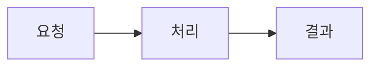
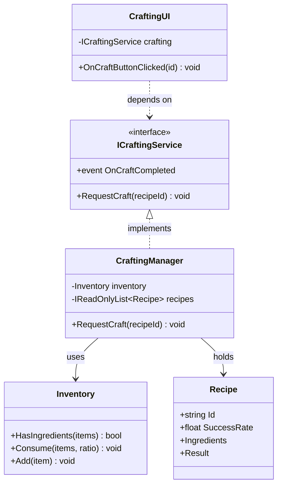
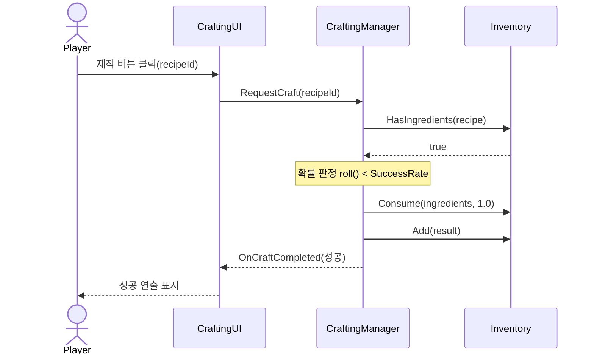
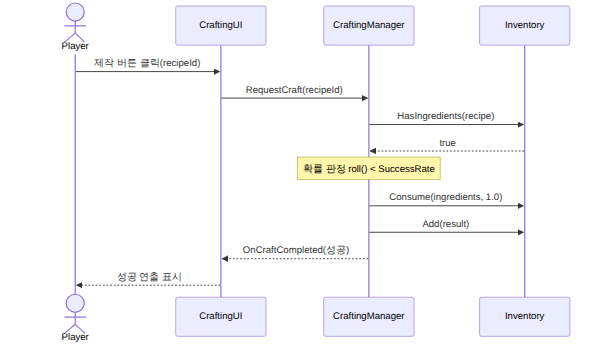
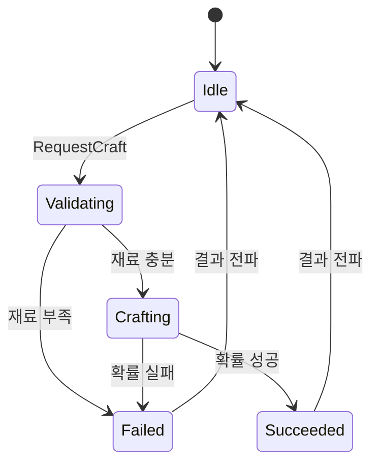
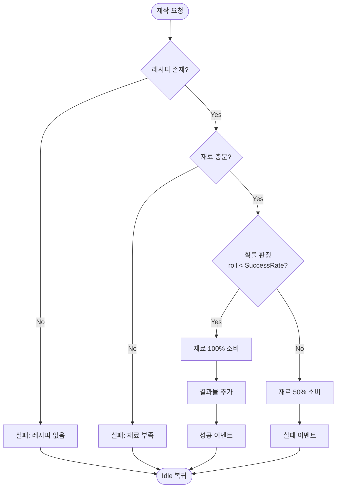
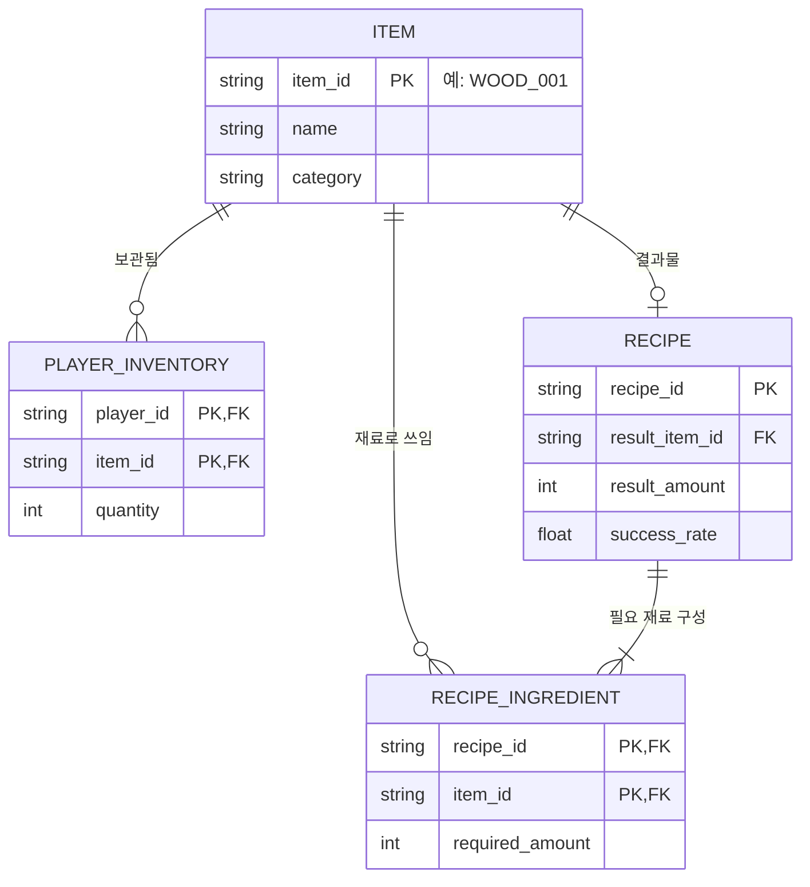

# Part 4. Mermaid 다이어그램 작성법

기술 문서의 **시스템 구조**(Part 2)를 가장 잘 전달하는 도구가 다이어그램입니다.
이 파트는 **Mermaid**로 5종 다이어그램을 그리는 법을 다룹니다.

> **이 파트의 전제**: 문법을 처음부터 외우지 않습니다. **AI에게 시켜서 만들고,
> 여러분은 "읽고 고칠 수 있으면" 충분합니다.** 그래서 각 다이어그램은
> *① 언제 쓰나 → ② 완성본(코드+그림) → ③ 읽는 법 → ④ AI에게 시키는 법* 순으로 봅니다.
> 실제 프롬프트는 Part 6에 모아 두었습니다.

## 4-1. Mermaid란?

**텍스트(코드)로 쓰면 그림이 되는** 다이어그램 도구입니다.

- 코드라서 **Git으로 버전 관리**가 되고, 수정이 그림 편집보다 빠릅니다.
- **GitHub가 네이티브로 렌더링**합니다. ` ```mermaid ` 코드 블록을 쓰면 Repo에서 그림으로 보입니다.
- **AI가 잘 만들어 줍니다.** "이런 관계를 클래스 다이어그램으로 그려줘"라고 하면 코드가 나옵니다.

### GitHub에서 렌더링되는 원리

아래처럼 코드 블록의 언어를 `mermaid`로 지정하면 됩니다.

````markdown

````

> **주의**: GitHub **Repo**(README 등)에서는 위 방식이 자동 렌더링됩니다.
> 하지만 **GitHub Pages(github.io)** 나 **Marp 슬라이드**에서는 추가 설정이나
> 이미지 변환이 필요합니다. 이 변환 과정은 **Part 5(AI 워크플로우)** 에서 다룹니다.

---

## 4-2. 클래스 다이어그램 (Class Diagram)

### 언제 쓰나

**시스템 구조** 섹션의 핵심. 클래스들이 **어떤 관계**(상속·구현·의존·소유)를 맺는지 보여줍니다.
"이 시스템은 이런 부품들로 이루어져 있고, 서로 이렇게 연결된다"를 한 장으로 전달합니다.

### 완성본 — 크래프팅 시스템 클래스 관계




### 읽는 법 (관계 기호만 알면 됨)

| 기호 | 의미 | 이 그림에서 |
|---|---|---|
| `<|..` | 인터페이스 **구현** | `CraftingManager`가 `ICraftingService`를 구현 |
| `-->` | **사용/소유** | `CraftingManager`가 `Inventory`를 사용 |
| `..>` | **의존** | `CraftingUI`가 인터페이스에 의존 (구현체 아님 → DIP) |
| `+ / -` | public / private | `+RequestCraft`는 외부 공개, `-inventory`는 내부 |

> **핵심 포인트 하나**: `CraftingUI`가 `CraftingManager`(실선)가 아니라
> `ICraftingService`(점선, 인터페이스)에 연결된 것 — 이게 **느슨한 결합**의 증거입니다.
> 면접관은 이 점선 하나에서 "SOLID를 이해하는구나"를 읽습니다.

### AI에게 시키는 법 (요약)

> "다음 C# 클래스들의 관계를 Mermaid 클래스 다이어그램으로 그려줘.
> CraftingManager는 ICraftingService를 구현하고, Inventory를 사용하며…"

→ 전체 프롬프트는 **Part 6-3**에 있습니다.

---

## 4-3. 시퀀스 다이어그램 (Sequence Diagram)

### 언제 쓰나

**핵심 기능**의 처리 흐름. 객체들이 **시간 순서대로 어떤 메시지를 주고받는지** 보여줍니다.
"버튼을 누르면 → 무슨 일이 → 어떤 순서로 일어나는가"를 전달할 때 최적입니다.

### 완성본 — 제작 요청 성공 흐름





### 읽는 법

| 기호 | 의미 |
|---|---|
| `->>` | 실선 화살표 = **요청/호출** (동기 메시지) |
| `-->>` | 점선 화살표 = **응답/반환** 또는 이벤트 |
| `Note over` | 특정 참여자 위의 **부연 설명** (여기선 확률 판정) |

> **핵심 포인트**: `Mgr-->>UI`가 이벤트(`OnCraftCompleted`)라는 점.
> Manager가 UI를 직접 호출하지 않고 "결과가 나왔다"고 알리기만 합니다(관찰자 패턴).
> 클래스 다이어그램의 점선과 시퀀스의 이벤트가 **같은 설계 의도**를 다른 각도로 보여줍니다.

### AI에게 시키는 법 (요약)

> "다음 처리 순서를 Mermaid 시퀀스 다이어그램으로. 참여자는 Player, CraftingUI,
> CraftingManager, Inventory. 결과 전파는 이벤트라 점선으로…"
> → 전체 프롬프트는 **Part 6-3**.

---

## 4-4. 상태 다이어그램 / FSM (State Diagram)

### 언제 쓰나

**상태를 가진 시스템**을 설명할 때. 게임에서는 특히 자주 씁니다 —
캐릭터 AI, 게임 페이즈, 그리고 여기처럼 **제작 진행 상태**.
"어떤 상태들이 있고, 무슨 조건으로 전이되는가"를 전달합니다.

### 완성본 — 제작 상태 전이




### 읽는 법

| 기호 | 의미 |
|---|---|
| `[*]` | 시작(진입) / 종료 지점 |
| `-->` | 상태 전이 |
| `: 텍스트` | 전이 **조건/트리거** (재료 부족, 확률 성공 등) |

> **핵심 포인트**: `Crafting`에서 화살표가 `Succeeded`와 `Failed` 둘로 갈라지는 것 —
> 이게 **확률 기반 성공**이라는 규칙을 시각적으로 증명합니다.
> 그리고 모든 상태가 결국 `Idle`로 돌아와 **반복 제작**이 가능함을 보여줍니다.

### AI에게 시키는 법 (요약)

> "제작 시스템의 상태 흐름을 Mermaid stateDiagram으로. 상태는 Idle, Validating,
> Crafting, Succeeded, Failed이고 전이 조건은…"
> → 전체 프롬프트는 **Part 6-3**.

---

## 4-5. 플로우차트 (Flowchart)

### 언제 쓰나

**의사결정과 분기**가 있는 로직. `if/else`가 여러 겹인 함수의 흐름을 설명할 때 최적입니다.
상태 다이어그램이 "상태의 전이"라면, 플로우차트는 "처리의 갈림길"에 집중합니다.

### 완성본 — RequestCraft 내부 분기




### 읽는 법

| 기호 | 의미 |
|---|---|
| `([텍스트])` | 시작/끝 (둥근 모서리) |
| `{텍스트}` | **판단(분기)** — 마름모 |
| `[텍스트]` | 처리(작업) — 사각형 |
| `-->|라벨|` | 분기 결과 (Yes/No) |
| `TD` | Top-Down(위→아래). `LR`은 Left-Right |

> **핵심 포인트**: 3단 분기(레시피 → 재료 → 확률)를 거쳐 모든 경로가 `Idle 복귀`로
> 수렴하는 구조. 이 그림 한 장이 Part 2의 `RequestCraft` 코드와 **정확히 일대일**로 대응합니다.
> 코드와 그림이 일치하면, 독자는 코드를 안 읽고도 로직을 이해합니다.

### AI에게 시키는 법 (요약)

> "RequestCraft 함수의 분기 로직을 Mermaid 플로우차트(TD)로. 레시피 존재 확인 →
> 재료 충분 확인 → 확률 판정 순서로 분기하고…"
> → 전체 프롬프트는 **Part 6-3**.

---

## 4-6. ER 다이어그램 (Entity-Relationship)

### 언제 쓰나

**데이터가 어떻게 저장·구조화되는가**를 보여줄 때. 클래스 다이어그램이 "런타임 객체 구조"라면,
ER은 "저장 데이터 구조"입니다. 게임에서는 아이템·레시피 같은 데이터를
CSV·DB·구글 시트로 관리하는 경우가 많은데, 그 **테이블 구조와 관계**를 설명합니다.

> 크래프팅 데이터를 코드에 하드코딩하지 않고 **데이터로 분리**하면(Part 2 회고에서 언급한
> 개선 방향), 기획자가 코드 없이 레시피를 편집할 수 있습니다. 그 저장 구조가 바로 ER입니다.

### 완성본 — 크래프팅 저장 데이터 구조




### 읽는 법

| 기호 | 의미 |
|---|---|
| `PK` | 기본 키 (Primary Key) — 행을 고유하게 식별 |
| `FK` | 외래 키 (Foreign Key) — 다른 테이블을 참조 |
| `||--o{` | 일대다 (1 : 0..N) — 한 아이템이 여러 레시피 재료로 쓰임 |
| `||--|{` | 일대다 (1 : 1..N) — 한 레시피는 재료가 최소 1개 |
| `||--o|` | 일대일 (1 : 0..1) |

> **핵심 포인트**: `RECIPE_INGREDIENT`는 `RECIPE`와 `ITEM`을 잇는 **연결 테이블**입니다.
> "레시피 하나에 재료 여럿, 재료 하나가 여러 레시피에 쓰임"이라는 **다대다(N:M)** 관계를
> 풀어낸 것 — 이 연결 테이블을 만들 줄 안다는 건 데이터 모델링 기본기의 증거입니다.
> 또 `item_id`에 `WOOD_001` 같은 **ID 규칙**을 적용하면 정렬·관리가 쉬워집니다.

### AI에게 시키는 법 (요약)

> "크래프팅 시스템의 저장 데이터를 Mermaid ER 다이어그램으로. 테이블은 ITEM, RECIPE,
> RECIPE_INGREDIENT(연결 테이블), PLAYER_INVENTORY이고 관계는…"
> → 전체 프롬프트는 **Part 6-3**.

---

## 4-7. 다섯 다이어그램, 하나의 시스템

같은 크래프팅 시스템을 5가지 각도로 본 것입니다. **무엇을 설명하느냐**에 따라 골라 쓰세요.

| 다이어그램 | 답하는 질문 | 기술 문서 섹션 |
|---|---|---|
| **클래스** | 무엇으로 이루어져 있는가? (런타임 구조) | 2. 시스템 구조 |
| **시퀀스** | 시간 순서로 어떻게 상호작용하는가? | 2·3. 구조/기능 |
| **상태(FSM)** | 어떤 상태를 오가는가? | 2·3. 구조/기능 |
| **플로우차트** | 어떤 갈림길을 지나는가? (로직) | 3. 핵심 기능 |
| **ER** | 데이터가 어떻게 저장되는가? (저장 구조) | 2. 시스템 구조 |

> **클래스 vs ER 대비**가 특히 유용합니다. 클래스는 *메모리 위 객체 관계*,
> ER은 *디스크/DB 위 데이터 관계*. 같은 크래프팅을 두 관점으로 보여주면
> "런타임과 저장을 모두 이해한다"는 인상을 줍니다.

> 하나의 기능에 5개를 다 넣을 필요는 없습니다. **설명하려는 것**에 맞는 다이어그램
> 1~2개를 고르세요. 클래스로 구조를 보이고, 플로우차트로 핵심 로직을 보이는 조합이 흔합니다.

## Part 4 정리

- Mermaid는 **코드로 그리는 다이어그램** — Git 관리·GitHub 렌더링·AI 생성에 유리.
- 5종을 **읽고 고칠 줄만** 알면 됩니다. 처음 작성은 AI에게 시키세요(Part 5·6).
- 각 다이어그램의 **"핵심 포인트"** 는 곧 여러분의 설계 의도(SOLID·이벤트 기반)를
  면접관에게 전달하는 지점입니다.
- 다음 파트(Part 5)에서 **AI로 이 다이어그램과 문서를 만드는 전체 워크플로우**를 다룹니다.
