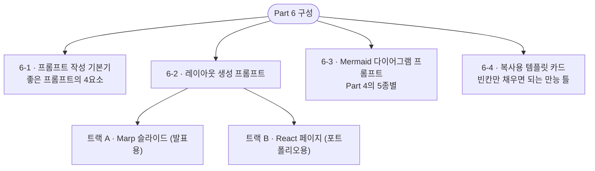

# Part 6. 좋은 레이아웃 프롬프트 모음

이 파트는 Part 3(레이아웃)과 Part 4(다이어그램)를 **AI로 생성하는 한글 프롬프트**를 모았습니다.
전부 **복사해서 바로 쓸 수 있는** 형태입니다.



> **사용법**: 각 프롬프트의 `[대괄호]` 부분만 여러분 프로젝트 내용으로 바꿔 쓰세요.
> 결과물은 반드시 **본인이 이해하고 검증**해야 합니다(Part 5-5 주의점).

---

## 6-1. 프롬프트 작성 기본기

좋은 프롬프트에는 4가지가 들어갑니다. 이 순서로 쓰면 결과물의 질이 확 올라갑니다.

| 요소 | 의미 | 예시 |
|---|---|---|
| **역할(Role)** | AI에게 어떤 전문가처럼 굴지 지정 | "너는 기술 문서 디자이너야" |
| **맥락(Context)** | 무엇을, 누구를 위해 만드는지 | "유니티 개발자 취업 포트폴리오용" |
| **제약(Constraints)** | 지켜야 할 조건 | "Marp 문법으로, 슬라이드 1장, 다크 테마" |
| **출력 형식(Format)** | 어떤 형태로 답할지 | "코드 블록으로만, 설명 없이" |

### 나쁜 프롬프트 vs 좋은 프롬프트

> **나쁜 예**: "크래프팅 슬라이드 만들어줘"
> → AI가 맥락·형식을 몰라 제멋대로 만듭니다.

> **좋은 예**: "너는 기술 문서 디자이너야(역할). 유니티 크래프팅 시스템을 소개하는
> 취업 포트폴리오 슬라이드가 필요해(맥락). Marp 마크다운 문법으로, 슬라이드 1장,
> 좌측 텍스트·우측 다이어그램 배치, 미니멀 테마로(제약). 코드 블록으로만 답해줘(형식)."
> → 의도한 결과에 훨씬 가깝게 나옵니다.

### 반복이 정상입니다

첫 결과가 완벽할 필요 없습니다. **"여기는 이렇게 바꿔줘"** 로 다듬는 게 정상 흐름입니다.

- "다이어그램을 더 크게, 설명은 한 줄로 줄여줘"
- "색을 파랑(페리윙클) 계열 하나로 통일해줘"
- "이 부분은 내 실제 코드로 바꿔줄게, 나머지 형식은 유지해줘"

---


---

## 6-2. 레이아웃 생성 프롬프트

Part 3의 레이아웃을 **두 가지 형태**로 생성합니다.

- **트랙 A — Marp 슬라이드**: 발표·PDF 배포용. 마크다운이라 가볍고 빠릅니다.
- **트랙 B — React 페이지**: 취업 포트폴리오용. 웹에 올리기 좋고, 깔끔하게 나옵니다.

> **어느 걸 쓰나?** 발표가 목적이면 A, 포트폴리오 웹페이지가 목적이면 B.
> 둘 다 만들어 두면 상황별로 골라 쓸 수 있습니다.

### 트랙 A. Marp 슬라이드 프롬프트

각 카드의 프롬프트를 복사해, `[대괄호]`만 바꿔 쓰세요.

#### A-① 표지 슬라이드

> **이럴 때**: 기술 문서·포트폴리오의 첫 장.

```text
너는 기술 문서 디자이너야. Marp 마크다운으로 발표 표지 슬라이드 1장을 만들어줘.
프로젝트명은 "[CraftingSystem]", 부제는 "[Technical Documentation]",
작성자는 "[김재훈 / jay.dev@email.com]"이야.
요소는 가운데 정렬, 프로젝트명이 가장 크게, 미니멀한 느낌으로.
Marp front-matter(theme, paginate 포함)와 함께 코드 블록으로만 답해줘.
```

#### A-② 다이어그램 중심 슬라이드 ★

> **이럴 때**: FSM·클래스·시퀀스 다이어그램을 보여주는 화면. **가장 자주 씁니다.**

```text
너는 기술 문서 디자이너야. Marp 마크다운으로 슬라이드 1장을 만들어줘.
제목은 "[시스템 구조 — 클래스 관계]"이고, 화면 대부분을 다이어그램 이미지가 차지해야 해.
이미지는 로 넣고, 그 아래에 핵심 포인트를 딱 한 줄만 캡션으로.
설명을 장황하게 넣지 말고 다이어그램이 주인공이 되게 해줘. 코드 블록으로만 답해줘.
```

#### A-③ 코드 + 설명 2단 슬라이드

> **이럴 때**: 핵심 기능의 코드와 "왜 이렇게 짰는지"를 나란히.

```text
너는 기술 문서 디자이너야. Marp 마크다운으로 좌우 2단 슬라이드 1장을 만들어줘.
왼쪽에는 아래 C# 코드 스니펫을, 오른쪽에는 "왜 이렇게 구현했는지" 불릿 2~3개를 배치해.
좌우가 균형 있게 보이도록 해줘. 코드는 이거야:
[여기에 본인 코드 스니펫 붙여넣기]
Marp에서 2단 배치가 되도록 CSS 포함해서 코드 블록으로만 답해줘.
```

#### A-④ 비교(Trade-off) 슬라이드 ★

> **이럴 때**: '고민과 선택'에서 대안 A vs B를 대칭으로.

```text
너는 기술 문서 디자이너야. Marp 마크다운으로 비교 슬라이드 1장을 만들어줘.
제목은 "[고민과 선택 — 결과 전파 방식]"이고, 좌우 2단으로 대안 A와 B를 대칭 배치해.
[A: 직접 참조 / 장점 …, 단점 …] [B: 이벤트 / 장점 …, 단점 …]
하단에는 최종 결정과 이유를 강조해서 한 줄로. 코드 블록으로만 답해줘.
```

#### A-⑤ 회고 슬라이드

> **이럴 때**: 문서 마지막, 결과·아쉬움·계획 정리.

```text
너는 기술 문서 디자이너야. Marp 마크다운으로 마무리 슬라이드 1장을 만들어줘.
"달성 / 아쉬운 점 / 향후 계획" 세 항목을 각각 기호(✓ △ →)로 구분해서 정리해줘.
내용은: 달성[…], 아쉬움[…], 계획[…]. 깔끔하게, 코드 블록으로만.
```

> **나머지 레이아웃(목차·개요·타임라인)** 도 위 패턴을 그대로 응용하면 됩니다.
> "[레이아웃 종류]를 Marp 슬라이드 1장으로, [내용] 담아서, [배치 방식]으로" 형태.

---

### 트랙 B. React 페이지 프롬프트 (포트폴리오용)

취업 포트폴리오는 **웹페이지로 깔끔하게** 보여주면 인상이 좋습니다.
입문자는 **설치·빌드 없이 파일 하나**로 만드는 방식을 추천합니다.

> **핵심 제약**: "React를 CDN으로 불러오는 단일 HTML 파일"로 요청하세요.
> 그러면 결과물이 `.html` 하나로 나와서, **더블클릭하면 브라우저에서 바로 열리고**
> github.io에 파일 하나만 올리면 배포됩니다.

#### B-① 프로젝트 상세 페이지

> **이럴 때**: 프로젝트 하나를 소개하는 포트폴리오 상세 페이지.

```text
너는 취업 포트폴리오를 만드는 프론트엔드 디자이너야.
설치나 빌드 없이 브라우저에서 바로 열리는 "단일 HTML 파일"로 만들어줘.
React는 CDN(unpkg)으로 불러오고, 스타일은 Tailwind CDN을 써줘.

내용: 유니티 프로젝트 "[CraftingSystem]"의 상세 페이지.
- 상단: 프로젝트명 + 한 줄 소개 + 기술 스택 태그(Unity, C#, 이벤트 기반)
- 개요 섹션: What / Why
- 시스템 구조 섹션: 다이어그램 이미지 () 크게
- 핵심 기능 섹션: 코드 스니펫 + 설명
- 회고 섹션: 달성 / 아쉬움 / 계획

디자인은 취업용답게 깔끔하고 절제된 느낌으로. 템플릿 같지 않게, 여백과 타이포그래피를
신경 써줘. 색은 배경/텍스트/강조 3색 안에서 통일. 전체를 하나의 .html 코드로 답해줘.
```

#### B-② 포트폴리오 요약(랜딩) 페이지

> **이럴 때**: 여러 프로젝트를 한눈에 보여주는 첫 페이지.

```text
너는 취업 포트폴리오를 만드는 프론트엔드 디자이너야.
단일 HTML 파일(React CDN + Tailwind CDN)로 포트폴리오 랜딩 페이지를 만들어줘.

내용:
- 헤더: 이름 "[김재훈(Jay)]" + 한 줄 정체성 "[유니티/VR 개발자]" + 연락처·GitHub 링크
- 기술 스택: 경험 기반으로 (예: "Unity — FSM·이벤트 기반 시스템 설계")
- 대표 프로젝트 카드 3개: 각 카드에 프로젝트명·한 줄 소개·기술 태그·상세 페이지 링크
- 반응형(모바일에서도 깔끔하게)

깔끔하고 절제된 디자인, 3색 이내로 통일. 하나의 .html 코드로 답해줘.
```

#### B-③ 다이어그램을 돋보이게 하는 섹션

> **이럴 때**: Mermaid 다이어그램 이미지를 페이지에서 크게 강조.

```text
방금 만든 페이지에서, 시스템 구조 섹션을 이렇게 바꿔줘.
다이어그램 이미지를 화면 중앙에 크게 배치하고, 이미지 위에는 짧은 제목,
아래에는 "이 그림에서 봐야 할 핵심" 한 줄 캡션만. 주변 여백을 넉넉히 줘서
다이어그램이 주인공이 되게. 나머지 섹션은 그대로 두고 이 부분만 수정해줘.
```

> **더 깊이 배우고 싶다면**: 위 단일 HTML 방식이 익숙해지면, `npm`으로 정식 React
> 프로젝트(Vite 등)를 구성하는 방법도 있습니다. 컴포넌트 분리·라우팅 등을 제대로 다룰 수
> 있지만 설치·빌드 과정이 필요합니다. **스스로 찾아보며 확장해 보세요** —
> 그 과정 자체가 좋은 포트폴리오 소재가 됩니다.

---


---

## 6-3. Mermaid 다이어그램 프롬프트

Part 4의 5종 다이어그램을 생성하는 프롬프트입니다. 결과로 **Mermaid 코드**가 나오며,
GitHub md에 붙이거나 mermaid.live에서 이미지로 변환하세요(Part 5-5).

> **공통 팁**: 프롬프트 끝에 *"Mermaid 코드 블록으로만 답하고, 설명은 빼줘"* 를 붙이면
> 바로 복사해 쓸 수 있는 코드만 받습니다.

#### C-① 클래스 다이어그램

> **이럴 때**: 클래스들의 구조·관계(상속·구현·의존).

```text
다음 관계를 Mermaid 클래스 다이어그램(classDiagram)으로 그려줘.
- [CraftingManager]는 [ICraftingService] 인터페이스를 구현한다
- [CraftingManager]는 [Inventory]를 사용(-->)하고 [Recipe]를 가진다
- [CraftingUI]는 구현체가 아니라 [ICraftingService] 인터페이스에 의존(..>)한다
각 클래스의 주요 필드·메서드도 넣어줘. Mermaid 코드 블록으로만 답해줘.
```

#### C-② 시퀀스 다이어그램

> **이럴 때**: 시간 순서대로 객체들이 주고받는 메시지.

```text
다음 처리 순서를 Mermaid 시퀀스 다이어그램(sequenceDiagram)으로 그려줘.
참여자: [Player, CraftingUI, CraftingManager, Inventory]
순서:
1) [Player가 제작 버튼 클릭]
2) [CraftingUI → CraftingManager: RequestCraft]
3) [CraftingManager → Inventory: 재료 검증]
...
결과 전파는 이벤트라 점선(-->>)으로 표현해줘. Mermaid 코드 블록으로만 답해줘.
```

#### C-③ 상태 다이어그램 (FSM)

> **이럴 때**: 상태와 전이 조건 (캐릭터 AI, 게임 페이즈, 제작 진행 등).

```text
다음 상태 흐름을 Mermaid 상태 다이어그램(stateDiagram-v2)으로 그려줘.
상태: [Idle, Validating, Crafting, Succeeded, Failed]
전이:
- Idle → Validating ([RequestCraft])
- Validating → Failed ([재료 부족]) / → Crafting ([재료 충분])
- Crafting → Succeeded ([확률 성공]) / → Failed ([확률 실패])
- Succeeded·Failed → Idle ([결과 전파])
시작은 [*] --> Idle로. Mermaid 코드 블록으로만 답해줘.
```

#### C-④ 플로우차트

> **이럴 때**: if/else 분기가 여러 겹인 로직의 흐름.

```text
다음 함수의 분기 로직을 Mermaid 플로우차트(flowchart TD)로 그려줘.
[RequestCraft] 함수:
- [레시피 존재?] 아니오 → 실패 / 예 → 다음
- [재료 충분?] 아니오 → 실패 / 예 → 다음
- [확률 판정?] 성공 → 재료 100% 소비 → 결과물 추가 → 성공 이벤트
              실패 → 재료 50% 소비 → 실패 이벤트
- 모든 경로는 [Idle 복귀]로 수렴
판단은 마름모{}, 처리는 사각형[]으로. Mermaid 코드 블록으로만 답해줘.
```

#### C-⑤ ER 다이어그램

> **이럴 때**: 데이터 저장 구조(테이블·관계). CSV·DB·구글시트로 관리하는 데이터.

```text
다음 저장 데이터 구조를 Mermaid ER 다이어그램(erDiagram)으로 그려줘.
테이블:
- [ITEM] (item_id PK, name, category)
- [RECIPE] (recipe_id PK, result_item_id FK, success_rate)
- [RECIPE_INGREDIENT] (recipe_id FK, item_id FK, required_amount) — 연결 테이블
- [PLAYER_INVENTORY] (player_id, item_id, quantity)
관계: [레시피 하나에 재료 여럿(다대다는 연결 테이블로), 아이템은 여러 곳에서 참조]
Mermaid 코드 블록으로만 답해줘.
```

---

## 6-4. 복사용 템플릿 카드

위 예시들을 관통하는 **만능 틀**입니다. 빈칸만 채우면 어떤 상황에도 대응됩니다.

### 만능 틀 ① — 다이어그램 생성

```text
다음 [무엇]을 Mermaid [다이어그램 종류]로 그려줘.
[구성요소·관계·순서를 목록으로 구체적으로 나열]
[특별히 강조할 표현 방식: 점선/마름모/PK·FK 등]
Mermaid 코드 블록으로만 답하고 설명은 빼줘.
```

### 만능 틀 ② — Marp 슬라이드 생성

```text
너는 기술 문서 디자이너야. Marp 마크다운으로 슬라이드 [N]장을 만들어줘.
제목은 "[제목]", 담을 내용은 [내용].
레이아웃은 [배치 방식: 좌우 2단 / 다이어그램 중심 / 비교 등].
테마는 [미니멀/다크], 코드 블록으로만 답해줘.
```

### 만능 틀 ③ — React 포트폴리오 페이지 생성

```text
너는 취업 포트폴리오를 만드는 프론트엔드 디자이너야.
설치·빌드 없이 브라우저에서 바로 열리는 단일 HTML 파일로 만들어줘.
React는 CDN, 스타일은 Tailwind CDN 사용.
내용: [섹션별 내용 나열]
디자인은 취업용답게 깔끔하고 절제되게, 템플릿 같지 않게, 3색 이내 통일, 반응형.
전체를 하나의 .html 코드로 답해줘.
```

### 만능 틀 ④ — 결과물 다듬기

```text
방금 만든 [슬라이드/페이지/다이어그램]에서 [이 부분]을 [이렇게] 바꿔줘.
나머지는 그대로 유지하고 이 부분만 수정해줘.
```

> **다듬기 틀(④)이 실무의 핵심**입니다. 한 번에 완성하려 하지 말고,
> 만능 틀 ①~③으로 초안을 받은 뒤 ④로 반복해서 다듬으세요.

---

## Part 6 정리

- 좋은 프롬프트 = **역할 + 맥락 + 제약 + 출력 형식**.
- 레이아웃은 **Marp(발표) / React 단일 HTML(포트폴리오)** 두 트랙으로 생성.
- 다이어그램은 5종별 프롬프트로 Mermaid 코드를 받아, GitHub나 mermaid.live에서 렌더링.
- **만능 틀 4개**만 있으면 대부분의 상황에 대응 — 특히 **다듬기 틀**로 반복 개선.
- 그리고 언제나: **AI가 만든 것을 이해하고 검증**해야 여러분의 실력이 됩니다(Part 5-5).

---

> **가이드를 마치며**
> 지금까지 취업 문서(Part 1) → 기술 문서(Part 2) → 레이아웃(Part 3) →
> 다이어그램(Part 4) → AI 워크플로우(Part 5) → 프롬프트(Part 6)를 지나왔습니다.
> 도구와 AI는 속도를 줄 뿐, **여러분이 이해하고 판단한 것**만이 실력으로 남습니다.
> 잘 읽히는 문서로, "함께 일하고 싶은 개발자"임을 증명하세요.
